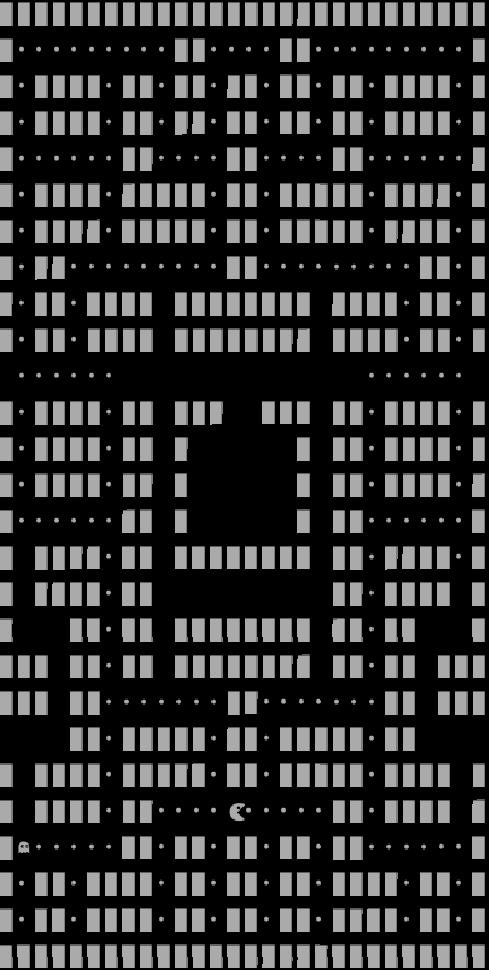
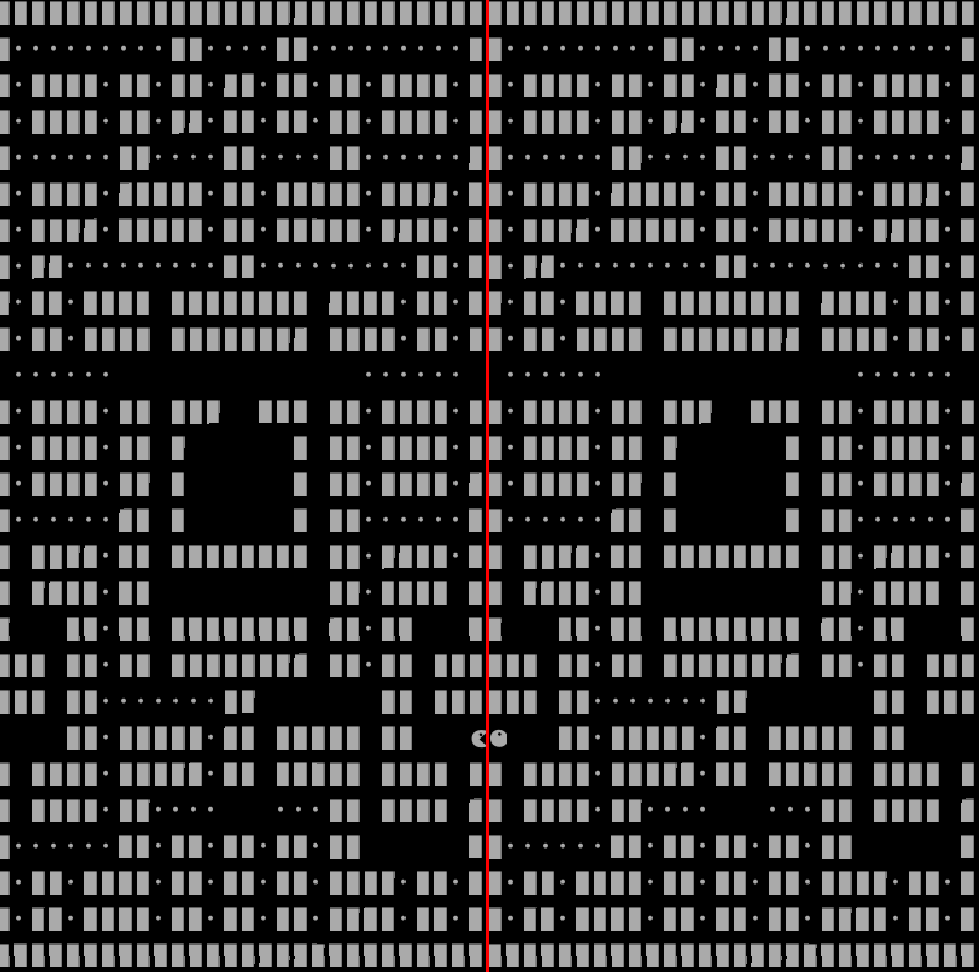

## LDTS_2LEIC01_G0101 - Pac-Man

In this classic arcade game you help the Pac-Man escape a maze, by collecting all the points layed inside it, while also avoiding all the *spooky* ghosts that are haunting him.

This project was developed by *Iraklis Konsoulas* (*up202102051*@fe.up.pt), *João Aires Gonçalves* (*up201905175*@up.pt) and *Diogo Filipe Faia Nunes* (*up202007895*@edu.fc.up.pt) for LDTS 2021⁄22.

### IMPLEMENTED FEATURES

- **Ghosts** - There are Ghosts characters inside the game haunting the maze trying to eat the Pac-Man.
    
    
- **Points** - When the game character collects all the points layed inside the maze the game finishes.

    
- **Pac-Man** - The user-controlled game character that collects all the points layed inside the maze trying to avoid the ghosts.

    
- **Side Exits** - When the game character passes through the side exits of the map it immediately appears on the other side of the screeen.

    
- **Graphics** - The graphics are implemented using fonts made in FontForge.

    

### PLANNED FEATURES

- **Power-Ups** - The game character should be able to consume power-ups layed in the maze in order to have the ability to consume ghosts.
- **Lives** - In the classic arcade game the player has 3 lives to spend trying to finish the game.
- **Score** - A scoreboard could be kept in order to track the progress in the players' results and increase the competition.
- **More Mazes** - After completing one maze the game character teleports to a different maze trying to solve that one too.
- **Music / Sound effects** - As the game commences, the classic music of Pac-Man should play in the background, while also the sound effects of Pac-Man consuming the points should be heard.

### DESIGN

### KNOWN CODE SMELLS AND REFACTORING SUGGESTIONS

#### MAZE CLASS

The method `processKey` is too long, it can affect readability.

A way to improve is to divide each direction in different methods.

The maze class does too much, making some classes lazy.

There are several methods that should be in each character instead of maze, such as `characterInteractsWithEnemy` and `characterInteractsWithPoint`.

To improve this these methods should be in the Game Characters class.

#### PACMAN CLASS

The pacman class is a lazy class. It should be responsible for the movement of pacman.

A way to improve this is to create a method in the pacman class that maze can call in order to move pacman.

### TESTING

- Coverage Testing Results

- Mutation Testing:
We couldn't make this test, only errors showed.

### SELF-EVALUATION

- Iraklis Konsoulas : 15%
- João Aires Gonçalves : 42.5%
- Diogo Filipe Faia Nunes : 42.5%